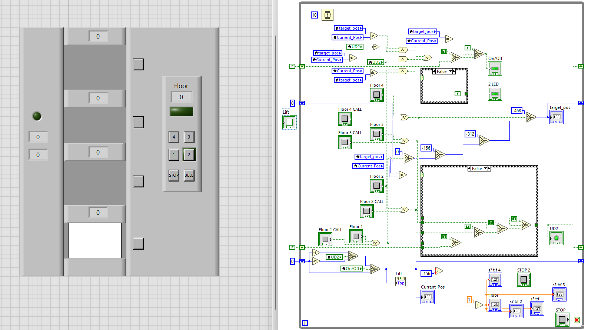
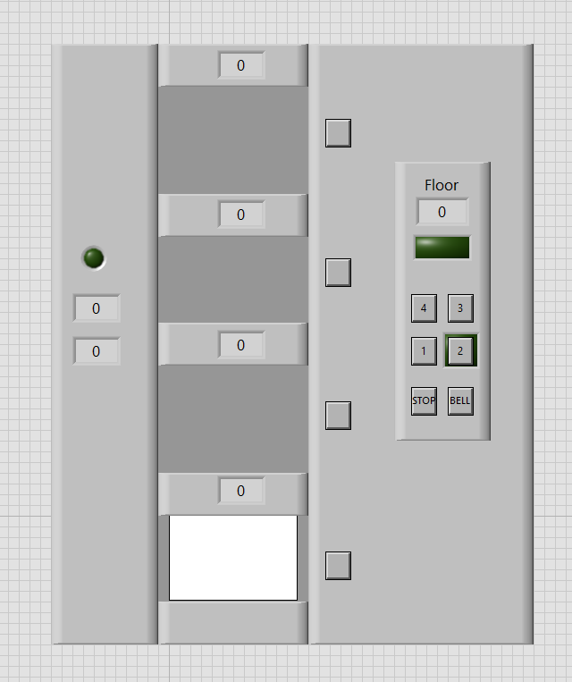
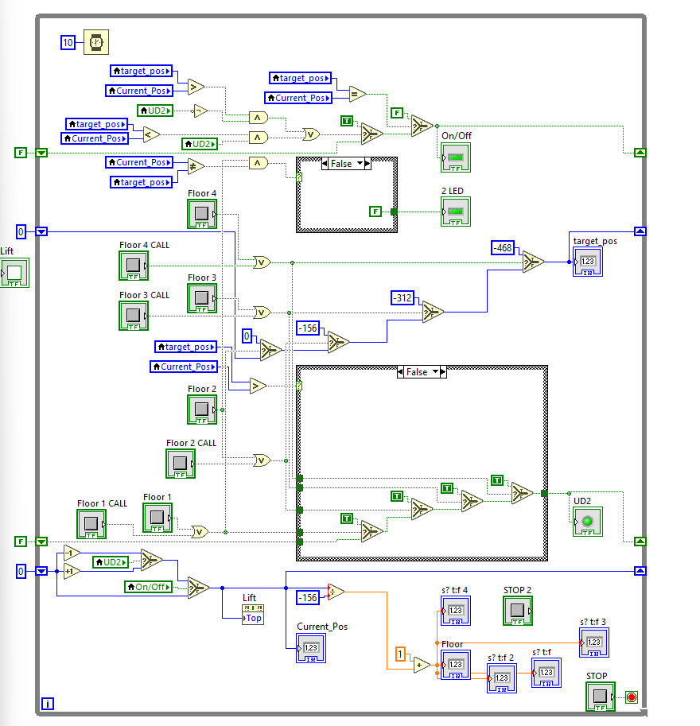

# Elevator in LabVIEW

This repository contains a simple elevator simulation made in **LabVIEW**. It demonstrates elevator logic using **while loops**, **coordinates**, and basic control logic.

## Files

- **Lift.vi** – Main VI for the elevator  
- **LiftV2.vi** – Updated version with improved logic  
- **LogicLift.txt** – Elevator logic description  

## Images

**Picture 1** – Front panel and block diagram  
  

**Picture 2** – Front panel only  
  

**Picture 3** – Block diagram only  
  
